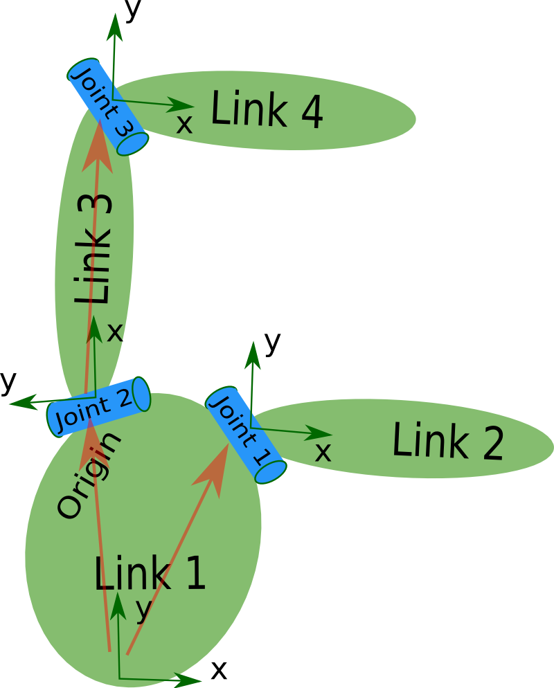

# XML Robot Description Format (URDF)

The Unified Robot Description Format (URDF) is an XML specification to describe a robot. We attempt to keep this specification as general as possible, but obviously the specification cannot describe all robots. The main limitation at this point is that only tree structures can be represented, ruling out all parallel robots. Also, the specification assumes the robot consists of rigid links connected by joints; flexible elements are not supported. The specification covers:

 * Kinematic and dynamic description of the robot
 * Visual representation of the robot
 * Collision model of the robot

The description of a robot consists of a set of [link elements](./link.md), and a set of [joint elements](./joint.md) connecting the links together. So a typical robot description looks something like this:

~~~xml
<?xml version="1.0"?>
<?xml-model href="https://raw.githubusercontent.com/ros/urdfdom/master/xsd/urdf.xsd" ?>
<robot name="pr2" xmlns="http://www.ros.org">
  <link> ... </link>
  <link> ... </link>
  <link> ... </link>

  <joint>  ....  </joint>
  <joint>  ....  </joint>
  <joint>  ....  </joint>
</robot>
~~~

You can see that the root element of the URDF format is a `<robot>` element.

## `<link>`  element
For details on the link description format, check out the [link elements](./link.md) page.

## `<joint>`  element
For details on the joint description format, check out the [joint elements](./joint.md) page.
