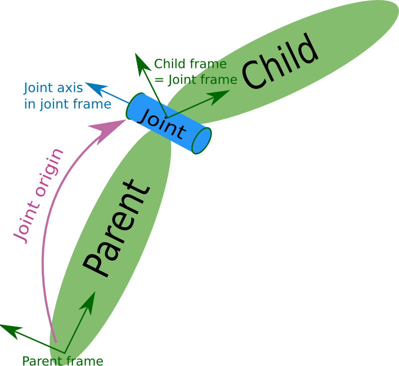

# `<joint>` element

The joint element describes the kinematics and dynamics of the joint and also specifies the [safety limits](http://wiki.ros.org/pr2_controller_manager/safety_limits) of the joint.



## Attributes

| attribute | type        | use      | default value | description                                                                    |
| --------- | ----------- | -------- | ------------- | ------------------------------------------------------------------------------ |
| `name`    | `string`      | required | NA            | Specifies a unique name of the join.                                           |
| `type`    | `JointType` | required | NA            | Specifies the type of joint, see "Type: `JointType`" section for more details. |

### Type: `JointType`

where type can be one of the following:
- `revolute`: a hinge joint that rotates along the axis and has a limited range specified by the upper and lower limits.
- `continuous`: a continuous hinge joint that rotates around the axis and has no upper and lower limits.
- `prismatic`: a sliding joint that slides along the axis, and has a limited range specified by the upper and lower limits.
- `fixed`: this is not really a joint because it cannot move. All degrees of freedom are locked. This type of joint does not require the `<axis>`, `<calibration>`, `<dynamics>`, `<limits>` or `<safety_controller>`.
- `floating`: this joint allows motion for all 6 degrees of freedom.
- `planar`: this joint allows motion in a plane perpendicular to the axis.

## Elements

The joint element has following elements:

| element                                     | use                                                                                                |
| ------------------------------------------- | -------------------------------------------------------------------------------------------------- |
| [`<parent>`](#parent)                       | required                                                                                           |
| [`<child>`](#child)                         | required                                                                                           |
| [`<origin>`](#origin)                       | optional: defaults to identity if not specified                                                    |
| [`<axis>`](#axis)                           | optional: defaults to (1,0,0)                                                                      |
| [`<calibration>`](#calibration)             | optional                                                                                           |
| [`<dynamics>`](#dynamics)                   | optional                                                                                           |
| [`<limit>`](#limit)                         | required only for revolute and prismatic joint                                                     |
| [`<mimic>`](#mimic)                         | optional (New with ROS Groovy. See [issue](https://github.com/ros/robot_state_publisher/issues/1)) |
| [`<safety_controller>`](#safety_controller) | optional                                                                                           |

### `<origin>`

This is the transform from the parent link to the child link. The joint is located at the origin of the child link, as shown in the figure above.

| attribute | type     | use      | default value | description                                                                                                                                        |
| --------- | -------- | -------- | ------------- | -------------------------------------------------------------------------------------------------------------------------------------------------- |
| `xyz`     | `string` | optional | zero vector   | Represents the x, y, z offset. All positions are specified in metres.                                                                              |
| `rpy`     | `string` | optional | zero vector   | Represents the rotation around fixed axis: first roll around x, then pitch around y and finally yaw around z. All angles are specified in radians. |

### `<parent>`

| attribute | type     | use      | default value | description                                                                       |
| --------- | -------- | -------- | ------------- | --------------------------------------------------------------------------------- |
| `link`    | `string` | required | NA            | The name of the link that is the parent of this link in the robot tree structure. |

### `<child>`

| attribute | type   | use      | default value | description                                  |
| --------- | ------ | -------- | ------------- | -------------------------------------------- |
| `link`    | `string` | required | NA            | The name of the link that is the child link. |

### `<axis>`

The joint axis specified in the joint frame. This is the axis of rotation for revolute joints, the axis of translation for prismatic joints, and the surface normal for planar joints. The axis is specified in the joint frame of reference. Fixed and floating joints do not use the axis field.

| attribute | type     | use      | default value | description                                                                       |
| --------- | -------- | -------- | ------------- | --------------------------------------------------------------------------------- |
| `xyz`     | `string` | required | NA            | Represents the (x, y, z) components of a vector. The vector should be normalized. |

### `<calibration>`

The reference positions of the joint, used to calibrate the absolute position of the joint.

| attribute | type     | use      | default value | description                                                                                        |
| --------- | -------- | -------- | ------------- | -------------------------------------------------------------------------------------------------- |
| `rising`  | `double` | optional | ???           | When the joint moves in a positive direction, this reference position will trigger a rising edge.  |
| `falling` | `double` | optional | ???           | When the joint moves in a positive direction, this reference position will trigger a falling edge. |

### `<dynamics>`

An element specifying physical properties of the joint. These values are used to specify modeling properties of the joint, particularly useful for simulation.

| attribute  | type     | use      | default value | description                                                                                                                                                             |
| ---------- | -------- | -------- | ------------- | ----------------------------------------------------------------------------------------------------------------------------------------------------------------------- |
| `damping`  | `double` | optional | defaults to 0 | The physical damping value of the joint (in newton-seconds per metre [N∙s/m] for prismatic joints, in newton-metre-seconds per radian [N∙m∙s/rad] for revolute joints). |
| `friction` | `double` | optional | defaults to 0 | The physical static friction value of the joint (in newtons [N] for prismatic joints, in newton-metres [N∙m] for revolute joints).                                      |

### `<limit>`

(required only for revolute and prismatic joint)

| attribute  | type     | use      | default value | description                                                                                                                                                                                                                                |
| ---------- | -------- | -------- | ------------- | ------------------------------------------------------------------------------------------------------------------------------------------------------------------------------------------------------------------------------------------ |
| `effort`   | `double` | required | NA            | An attribute for enforcing the maximum joint effort (\|applied effort\| < \|effort\|). See safety limits.                                                                                                                                  |
| `velocity` | `double` | required | NA            | An attribute for enforcing the maximum joint velocity (in radians per second [rad/s] for revolute joints, in metres per second [m/s] for prismatic joints). [See safety limits](http://wiki.ros.org/pr2_controller_manager/safety_limits). |
| `lower`    | `double` | optional | defaults to 0 | An attribute specifying the lower joint limit (in radians for revolute joints, in metres for prismatic joints). Omit if joint is continuous.                                                                                               |
| `upper`    | `double` | optional | defaults to 0 | An attribute specifying the upper joint limit (in radians for revolute joints, in metres for prismatic joints). Omit if joint is continuous.                                                                                               |

### `<mimic>`

(optional) (New with ROS Groovy. See issue)

This tag is used to specify that the defined joint mimics another existing joint. The value of this joint can be computed as value = multiplier * other_joint_value + offset.

| attribute    | type     | use      | default value | description                                                                                                                |
| ------------ | -------- | -------- | ------------- | -------------------------------------------------------------------------------------------------------------------------- |
| `joint`      | `string` | required | NA            | This specifies the name of the joint to mimic.                                                                             |
| `multiplier` | `double` | optional | defaults to 1 | Specifies the multiplicative factor in the formula above.                                                                  |
| `offset`     | `double` | optional | defaults to 0 | Specifies the offset to add in the formula above. Defaults to 0 (radians for revolute joints, meters for prismatic joints) |

### `<safety_controller>`

| attribute          | type     | use      | default value | description                                                                                                                                                                                                                                                                                    |
| ------------------ | -------- | -------- | ------------- | ---------------------------------------------------------------------------------------------------------------------------------------------------------------------------------------------------------------------------------------------------------------------------------------------- |
| `k_velocity`       | `double` | required | NA            | An attribute specifying the relation between effort and velocity limits. See See safety limits for more details.                                                                                                                                                                               |
| `soft_lower_limit` | `double` | optional | defaults to 0 | An attribute specifying the lower joint boundary where the safety controller starts limiting the position of the joint. This limit needs to be larger than the lower joint limit (see above). See [safety limits](http://wiki.ros.org/pr2_controller_manager/safety_limits) for more details.  |
| `soft_upper_limit` | `double` | optional | defaults to 0 | An attribute specifying the upper joint boundary where the safety controller starts limiting the position of the joint. This limit needs to be smaller than the upper joint limit (see above). See [safety limits](http://wiki.ros.org/pr2_controller_manager/safety_limits) for more details. |
| `k_position`       | `double` | optional | defaults to 0 | An attribute specifying the relation between position and velocity limits. See [safety limits](http://wiki.ros.org/pr2_controller_manager/safety_limits) for more details.                                                                                                                     |

## Example

```xml
<joint name="my_joint" type="floating">
    <origin xyz="0 0 1" rpy="0 0 3.1416"/>
    <parent link="link1"/>
    <child link="link2"/>

    <calibration rising="0.0"/>
    <dynamics damping="0.0" friction="0.0"/>
    <limit effort="30" velocity="1.0" lower="-2.2" upper="0.7" />
    <safety_controller k_velocity="10" k_position="15" soft_lower_limit="-2.0" soft_upper_limit="0.5" />
</joint>
```