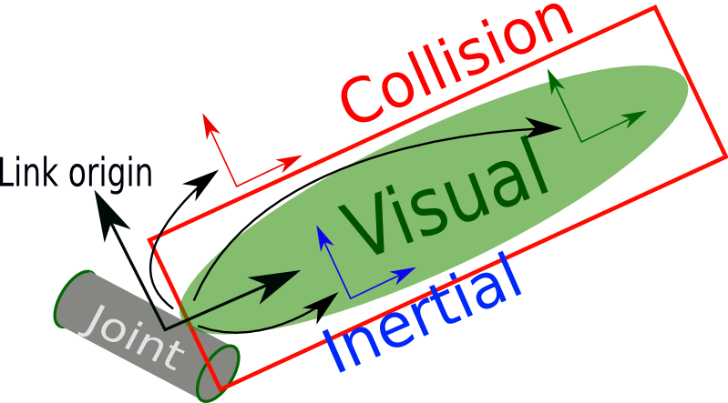

# Link

## `<link>` element

The link element describes a rigid body with an inertia, visual features, and collision properties.

Here is an example of a link element:

~~~xml
 <link name="my_link">
   <inertial>
     <origin xyz="0 0 0.5" rpy="0 0 0"/>
     <mass value="1"/>
     <inertia ixx="100"  ixy="0"  ixz="0" iyy="100" iyz="0" izz="100" />
   </inertial>

   <visual>
     <origin xyz="0 0 0" rpy="0 0 0" />
     <geometry>
       <box size="1 1 1" />
     </geometry>
     <material name="Cyan">
       <color rgba="0 1.0 1.0 1.0"/>
     </material>
   </visual>

   <collision>
     <origin xyz="0 0 0" rpy="0 0 0"/>
     <geometry>
       <cylinder radius="1" length="0.5"/>
     </geometry>
   </collision>
 </link>
~~~
 

## Attributes 
 * **`name`** *(required)* 
   * The name of the link itself.

## Elements
 * **`<inertial>`** *(optional: defaults to a zero mass and zero inertia if not specified)* 
   * The link’s mass, position of its center of mass, and its central inertia properties.
   * **`<origin>`** *(optional: defaults to identity if not specified)* 
     * This pose (translation, rotation) describes the position and orientation of the link’s center of mass frame C relative to the link-frame L.
     * **`xyz`** *(optional: defaults to zero vector)*
       * Represents the position vector from Lo (the link-frame origin) to Co (the link’s center of mass) as **x L̂x + y L̂y + z L̂z**, where **L̂x, L̂y, L̂z** are link-frame L's orthogonal unit vectors.
     * **`rpy`** *(optional: defaults to identity if not specified)*
       * Represents the orientation of C's unit vectors **Ĉx, Ĉy, Ĉz** relative to link-frame L as a sequence of Euler rotations (r p y) in radians.  Note: **Ĉx, Ĉy, Ĉz** do not need to be aligned with the link’s principal axes of inertia.
   * **`<mass>`**
     * The mass of the link is represented by the '''value''' attribute of this element
   * **`<inertia>`**
     * This link's moments of inertia **ixx, iyy, izz** and products of inertia **ixy, ixz, iyz** about Co (the link’s center of mass) for the unit vectors **Ĉx, Ĉy, Ĉz** fixed in the center-of-mass frame C.  Note: the orientation of **Ĉx, Ĉy, Ĉz** relative to **L̂x, L̂y, L̂z** is specified by the rpy values in the <origin> tag.  The attributes **ixx, ixy, ixz, iyy, iyz, izz** for some  primitive shapes are [here](https://en.wikipedia.org/wiki/List_of_moments_of_inertia#List_of_3D_inertia_tensors). URDF assumes a negative product of inertia convention (for more info, see [these MathWorks docs](https://www.mathworks.com/help/releases/R2021b/physmod/sm/ug/specify-custom-inertia.html#mw_b043ec69-835b-4ca9-8769-af2e6f1b190c) for working with CAD tools).  The simplest way to avoid compatibility issues associated with the negative sign convention for product of inertia is to align **Ĉx, Ĉy, Ĉz** with principal inertia directions so that all the products of inertia are zero.
 **`<visual>`** *(optional)*
  . The visual properties of the link. This element specifies the shape of the object (box, cylinder, etc.) for visualization purposes. **Note:** multiple instances of <visual> tags can exist for the same link. The union of the geometry they define forms the visual representation of the link.

  '''name''' ''(optional)''
   . Specifies a name for a part of a link's geometry. This is useful to be able to refer to specific bits of the geometry of a link.

  '''<origin>''' ''(optional: defaults to identity if not specified)''
   . The reference frame of the visual element with respect to the reference frame of the link.
   '''xyz''' ''(optional: defaults to zero vector)''
    . Represents the '''x''', '''y''', '''z''' offset.
   '''rpy''' ''(optional: defaults to identity if not specified)''
    . Represents the fixed axis roll, pitch and yaw angles in radians.
  '''<geometry>''' ''(required)''
   . The shape of the visual object. This can be ''one'' of the following:
   . '''<box>'''
    . '''size''' attribute contains the three side lengths of the box. The origin of the box is in its center.
   '''<cylinder>'''
    . Specify the '''radius''' and '''length'''. The origin of the cylinder is in its center. {{attachment:cylinder_coordinates.png||height="10%",width="10%"}}
   '''<sphere>'''
    . Specify the '''radius'''. The origin of the sphere is in its center.
   '''<mesh>'''
    . A trimesh element specified by a '''filename''', and an optional '''scale''' that scales the mesh's axis-aligned-bounding-box. Any geometry format is acceptable but specific application compatibility is dependent on implementation. The recommended format for best texture and color support is Collada .dae files. The mesh file is not transferred between machines referencing the same model. It must be a local file. Prefix the filename with '''package://<packagename>/<path>''' to make the path to the mesh file relative to the package <packagename>.
  '''<material>''' ''(optional)''
   . The material of the visual element. It is allowed to specify a material element outside of the 'link' object, in the top level 'robot' element. From within a link element you can then reference the material by name.
   .'''name''' name of the material
   .'''<color>''' ''(optional)''
     '''rgba''' The color of a material specified by set of four numbers representing red/green/blue/alpha, each in the range of [0,1].
   '''<texture>''' ''(optional)''
    . The texture of a material is specified by a '''filename'''
   
 '''<collision>''' ''(optional)''
  . The collision properties of a link. Note that this can be different from the visual properties of a link, for example, simpler collision models are often used to reduce computation time.  '''Note:''' multiple instances of <collision> tags can exist for the same link. The union of the geometry they define forms the collision representation of the link.

  '''name''' ''(optional)''
   . Specifies a name for a part of a link's geometry. This is useful to be able to refer to specific bits of the geometry of a link.
  '''<origin>''' ''(optional: defaults to identity if not specified)''
   . The reference frame of the collision element, relative to the reference frame of the link.
   '''xyz''' ''(optional: defaults to zero vector)''
    . Represents the '''x''', '''y''', '''z''' offset.
   '''rpy''' ''(optional: defaults to identity if not specified)''
    . Represents the fixed axis roll, pitch and yaw angles in radians.
  '''<geometry>'''
   . See the geometry description in the above visual element.

# Recommended Mesh Resolution
 * For collision checking using the [[moveit| ROS motion planning]] packages, as few faces per link as possible are recommended for the collision meshes that you put into the URDF (ideally less than 1000). If possible, approximating the meshes with other primitives is encouraged.

# Multiple Collision Bodies

It was decided that URDFs should not support multiple groups of collision bodies, even though there are sometimes applications for this. The URDF is intended to only represent the actual robot's properties, and not collisions used for external things like controller collision checking. In a URDF, the <visual> elements should be as accurate as possible to the real robot, and the <collision> elements should still be a close approximation, albeit with far fewer triangles in the meshes. 

If you do need coarser-grain, over sized collision geometries for things like collision checking and controllers, you can move these meshes/geometries to custom XML elements. For example, if your controllers need some special rough collision checking geometry, you could add the tag <collision_checking> after the <collision> element:

~~~xml
  <link name="torso">
    <visual>
      <origin rpy="0 0 0" xyz="0 0 0"/>
      <geometry>
        <mesh filename="package://robot_description/meshes/base_link.DAE"/>
      </geometry>
    </visual>
    <collision>
      <origin rpy="0 0 0" xyz="-0.065 0 0.0"/>
      <geometry>
        <mesh filename="package://robot_description/meshes/base_link_simple.DAE"/>
      </geometry>
    </collision>
    <collision_checking>
      <origin rpy="0 0 0" xyz="-0.065 0 0.0"/>
      <geometry>
        <cylinder length="0.7" radius="0.27"/>
      </geometry>
    </collision_checking>
    <inertial>
      ...
    </inertial>
  </link>  
~~~

A URDF will ignore these custom elements like "collision_checking", and your particular program can parse the XML itself to get this information.

